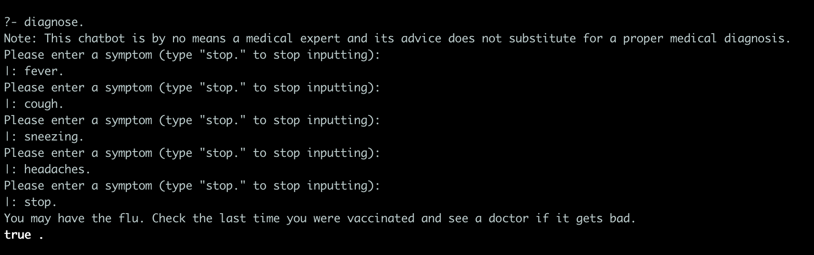

# DrCovid

This is an extremely simple chatbot built in Prolog that you can tell your symptoms to help you deduce if you have COVID-19 or some other common illness. It makes a deduction based on the known correlations between those symptoms and other illnessees (e.g. people who sneeze are far more likely to have seasonal allergies rather than COVID-19).

### Setup

Simply download the latest release and unzip the files. Navigate to wherever you unzipped the file with your CLI and run the command (presuming you have Prolog installed on your system) to start the program

```swipl -s DrCovid.pl```

### Usage

The primary command you'll want to use once you start the program is:

```diagnose.```

From there the program will ask you to input every single symptom you're feeling.
The list of the symptoms the program recognizes includes (case sensitive):

```
fever
fatigue
cough
sneezing
aches
runny_nose
sore_throat
diarrhea
headaches
difficulty_breathing
loss_of_taste_or_smell
```

Once you're done, simply enter `stop.` and the program will tell you the results of its internal calculations, and the illness it believes you most likely have. Run `diagnose.` again to make another diagnosis. Run `diagnose.` as many times as you want. Diagnose your entire family!

### Example Usage

Below are some screen shots of what this minimalistic medical marvel can do. 




Enjoy!

